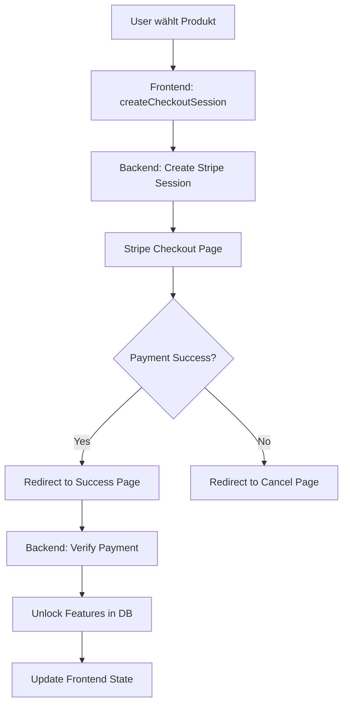

# 💳 Stripe Payment Integration Guide

## Übersicht

Diese Dokumentation beschreibt die Integration von Stripe für die Zahlungsabwicklung im KI Konzept Builder.

## 🔧 Setup

### 1. Stripe Account erstellen
1. Registriere dich bei [Stripe](https://stripe.com)
2. Hole dir deine API Keys:
   - **Publishable Key**: `pk_test_...` (für Frontend)
   - **Secret Key**: `sk_test_...` (für Backend)

### 2. Frontend Integration

```javascript
// In js/stripe-integration.js
const STRIPE_CONFIG = {
    publishableKey: 'pk_test_YOUR_KEY_HERE', // Ersetze mit deinem Key
    successUrl: 'https://yourdomain.com/payment-success.html',
    cancelUrl: 'https://yourdomain.com/pricing.html'
};
```

### 3. Backend Endpoints (Node.js/Express Beispiel)

```javascript
// backend/stripe-routes.js
const stripe = require('stripe')('sk_test_YOUR_SECRET_KEY');

// Create Checkout Session
app.post('/api/create-checkout-session', async (req, res) => {
    const { lineItems, customerEmail, metadata } = req.body;
    
    try {
        const session = await stripe.checkout.sessions.create({
            payment_method_types: ['card', 'sepa_debit'],
            line_items: lineItems,
            mode: 'payment',
            success_url: `${YOUR_DOMAIN}/payment-success.html?session_id={CHECKOUT_SESSION_ID}`,
            cancel_url: `${YOUR_DOMAIN}/pricing.html?canceled=true`,
            customer_email: customerEmail,
            metadata: metadata,
            locale: 'de'
        });
        
        res.json({ sessionId: session.id });
    } catch (error) {
        res.status(500).json({ error: error.message });
    }
});

// Verify Payment
app.get('/api/verify-payment/:sessionId', async (req, res) => {
    try {
        const session = await stripe.checkout.sessions.retrieve(
            req.params.sessionId,
            { expand: ['line_items', 'customer'] }
        );
        
        if (session.payment_status === 'paid') {
            // Unlock features in database
            await unlockUserFeatures(session.metadata.userId, session.metadata.productType);
            
            res.json({
                success: true,
                productType: session.metadata.productType,
                isPackage: session.metadata.isPackage === 'true',
                amount: session.amount_total / 100,
                currency: session.currency
            });
        } else {
            res.json({ success: false });
        }
    } catch (error) {
        res.status(500).json({ error: error.message });
    }
});

// Webhook for payment confirmation
app.post('/api/stripe-webhook', express.raw({type: 'application/json'}), (req, res) => {
    const sig = req.headers['stripe-signature'];
    let event;
    
    try {
        event = stripe.webhooks.constructEvent(req.body, sig, process.env.STRIPE_WEBHOOK_SECRET);
    } catch (err) {
        return res.status(400).send(`Webhook Error: ${err.message}`);
    }
    
    // Handle the event
    switch (event.type) {
        case 'checkout.session.completed':
            const session = event.data.object;
            // Fulfill the purchase...
            fulfillOrder(session);
            break;
        default:
            console.log(`Unhandled event type ${event.type}`);
    }
    
    res.json({received: true});
});
```

## 📦 Produkte in Stripe anlegen

### Einzelberatungen

1. **Businessplan-Beratung**
   - Preis: €250
   - Product ID: `prod_businessplan`
   - Price ID: `price_businessplan_250`

2. **Gründungsberatung**
   - Preis: €180
   - Product ID: `prod_gruendung`
   - Price ID: `price_gruendung_180`

3. **Finanzierungsberatung**
   - Preis: €300
   - Product ID: `prod_finanzierung`
   - Price ID: `price_finanzierung_300`

4. **Marketing-Beratung**
   - Preis: €150
   - Product ID: `prod_marketing`
   - Price ID: `price_marketing_150`

### Pakete

1. **Starter-Paket**
   - Preis: €490
   - Product ID: `prod_starter_package`
   - Price ID: `price_starter_490`

2. **Professional Paket**
   - Preis: €890
   - Product ID: `prod_professional_package`
   - Price ID: `price_professional_890`

3. **Premium Plus Paket**
   - Preis: €1490
   - Product ID: `prod_premium_package`
   - Price ID: `price_premium_1490`

## 🔄 Payment Flow



## 🔐 Sicherheit

1. **API Keys**
   - NIE den Secret Key im Frontend verwenden
   - Verwende Umgebungsvariablen für Keys
   - Rotiere Keys regelmäßig

2. **Webhook Validation**
   - Immer Webhook Signature validieren
   - IP Whitelisting für Webhook Endpoint

3. **HTTPS**
   - Alle Payment-Seiten müssen HTTPS verwenden
   - Redirect URLs müssen HTTPS sein

## 🧪 Testing

### Test Kreditkarten
- **Success**: `4242 4242 4242 4242`
- **Decline**: `4000 0000 0000 0002`
- **3D Secure**: `4000 0025 0000 3155`

### Test SEPA
- **Success**: `DE89370400440532013000`

## 📱 Mobile Optimization

Stripe Checkout ist automatisch mobile-optimiert. Stelle sicher dass:
- Deine Success/Cancel Pages responsive sind
- Touch-friendly Buttons verwendet werden
- Loading States klar erkennbar sind

## 🚀 Production Checklist

- [ ] Ersetze Test Keys mit Live Keys
- [ ] Konfiguriere Webhook Endpoint in Stripe Dashboard
- [ ] Setze korrekte Success/Cancel URLs
- [ ] Teste alle Payment Flows
- [ ] Implementiere Error Logging
- [ ] Setze up Email Notifications
- [ ] Erstelle Refund Policy Page
- [ ] DSGVO-konforme Datenspeicherung

## 📊 Reporting

Stripe Dashboard bietet:
- Echtzeit Transaktionen
- Revenue Reports
- Customer Insights
- Dispute Management

## 🆘 Support

- [Stripe Docs](https://stripe.com/docs)
- [Stripe Support](https://support.stripe.com)
- Test Mode für Development
- Stripe CLI für lokales Testing